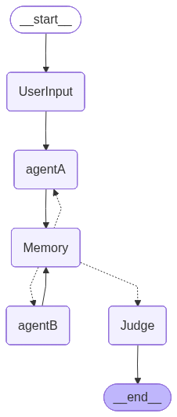

# Debate System Using LangGraph

This project implements a multi-turn debate workflow using **LangGraph**, where two agents (AgentA and AgentB) debate a user-provided topic, a memory node tracks arguments, and the judge node produces a final structured evaluation using both heuristic and LLM-based scoring.  

The project also generates a **complete debate transcript**, **agent summaries**, and a **full system log**.

---

## Features

- Multi-turn debate (8 rounds)
- AgentA argues **for** the topic  
- AgentB argues **against** the topic  
- Memory node stores transcript + detects repetition  
- Judge node:
  - Performs **heuristic scoring**
  - Performs **LLM scoring using Groq**
  - Trades off both methods to produce final scores
  - Returns JSON with winner + justification
- Full logging: transitions, memory updates, arguments, and final verdict  
- DAG of the workflow exported using Mermaid / GraphViz

---

# Install dependencies

```pip install -r requirements.txt```
- Requirements include:
  - langgraph
  - langchain-core
  - groq
  - requests
  - python-dotenv (optional)
  - graphviz

# Running the Debate Program
- Run:
```python debate_runner.py```

- You will be prompted:
```Enter the Topic for the debate:```

- Example:
```Should AI be regulated like medicine?```

- Outputs:
  - Full transcript
  - Judge evaluation
  - Winner + justification
  - Logs written to debate.log

## Project Structure
```
debate-system/
│
├── debate_runner.py          # Main entry point
├── stategraph.py             # LangGraph state machine (DAG)
├── langgraph_nodes.py        # All nodes: User, Agents, Memory, Judge
├── memory.py                 # Transcript store & repetition handling
├── utils.py                  # LLM generation via Groq
├── README.md                 # Documentation
├── requirements.txt
└── debate.log                # Full chat log (auto-generated)
```

## Node Descriptions
1. UserInput Node
- Reads the topic entered by user
- Initializes state:

2. AgentA Node
- Speaks on odd rounds
- Argues for the topic
- Writes to transcript
- Updates per_agent_summary

3. AgentB Node
- Speaks on even rounds
- Argues against the topic
- Writes to transcript
- Updates per_agent_summary

4. Memory Node
- Appends new transcript entries to persistent transcript_store
- Detects repetition
- Clears transcript for next round
- Allows agents to see only what they should see
- Does NOT modify round counter

5. Judge Node
- Performs:
  - Heuristic scoring
    - Based on keywords such as:
      - risk
      - ethics
      - benefits
      - evidence
  - LLM scoring (Groq)
    - Sends full transcript to:
      - llama-3.1-8b-instant
- Score Blending
```final = 0.6 * heuristic + 0.4 * llm```

## DAG / Workflow Graph
```
START
  ↓
UserInput
  ↓
AgentA  → Memory → AgentB → Memory → AgentA → ... (8 rounds)
  ↓
 Judge
  ↓
 END
```


## 1. Clone the project

```bash
git clone <repo-url>
cd debate-system
